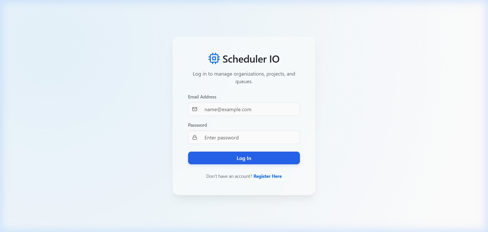
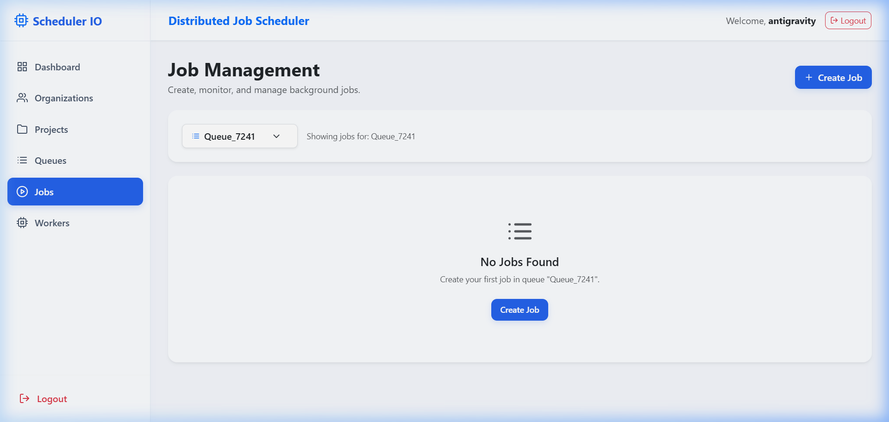
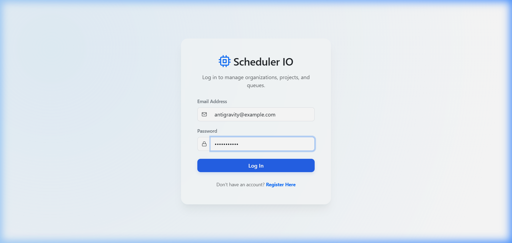
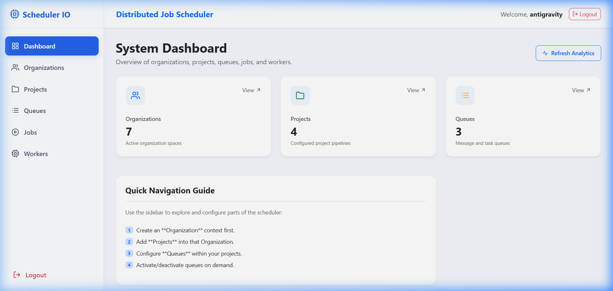
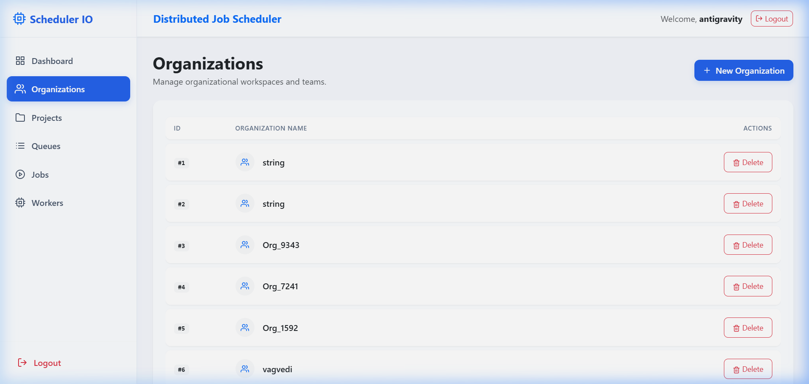

<h1 align="center">🖥️ Distributed Job Scheduler</h1>

<p align="center">
  <strong>A scalable, database-backed task coordinator with automatic retry policies, dead-letter queue routing, worker cluster heartbeat checks, and real-time dashboard telemetrics.</strong>
</p>

<p align="center">
  
  
  
  
  
</p>


## 📖 Project Overview

The **Distributed Job Scheduler** is a full-stack, production-ready orchestrator designed to manage background task workloads across distributed worker clusters. Built on a clean, stateless architecture, the system coordinates task delivery from prioritized channels to active computing nodes. The project demonstrates core scheduling paradigms, including **JWT-based authentication**, **multi-tenant organizational contexts**, **pipeline project grouping**, **prioritized queue management**, **job-lifecycle transitions**, **worker capacity routing**, **retry policies**, **dead-letter routing**, and a **real-time administration dashboard** featuring live health diagnostics and CSV logs export.

---

## ✨ Features

- 🔐 **Secure Session Access**: State-backed JWT authentication with secure password encryption.
- 🏢 **Multi-Tenant Contexts**: Organization workspaces containing isolated project environments.
- 🚦 **Active Priority Queuing**: Prioritized routing channels with dynamic activity switches.
- ⚙️ **Job State Machine**: Stateful transitions (`QUEUED` ➔ `RUNNING` ➔ `SUCCESS` / `FAILED` / `RETRY` ➔ `DEAD_LETTER`).
- 🔁 **Automatic Retry Policies**: Limit-based retries featuring configurable delays (`retry_delay_seconds`).
- ☣️ **Dead Letter Quarantine**: Automated capture of permanently failed jobs in a dedicated Dead Letter Queue (DLQ).
- 🤖 **Worker Cluster Telemetry**: Connected node monitoring, status reporting (`ACTIVE`, `IDLE`, `BUSY`, `OFFLINE`), workload assignments, and heartbeat check-ins.
- 📊 **Real-Time Administration**: Dynamic analytics dashboard displaying system health charts, live activity logs, advanced search/filters, and CSV logs export.

---

## 🛠️ Tech Stack

| Component | Technology | Description |
| :--- | :--- | :--- |
| **Frontend** | React 19, Vite, ES6 | Single-Page Application (SPA) dashboard UI |
| **Backend** | FastAPI, Python 3 | Async RESTful API service layer |
| **Database** | SQLite 3 | Embedded, lightweight relational storage |
| **ORM** | SQLAlchemy | Python Object Relational Mapper for schema sync |
| **Authentication** | OAuth2 + JWT (PyJWT) | Secure stateless token validation |
| **Styling** | Bootstrap 5, Custom CSS | Premium glassmorphism design layouts |
| **Icons** | React Icons (Feather Icons) | Modern visual glyph indicators |
| **Version Control**| Git / GitHub | Code management and releases |

---

## 📐 System Architecture

```text
       +--------------------------------------------+
       |               React Frontend               |
       |  (Dashboard UI / Filters / CSV Exporter)   |
       +---------------------+----------------------+
                             | REST APIs
                             v
       +---------------------+----------------------+
       |                FastAPI API                 |
       |     (Router / Auth Middleware / Schemas)   |
       +---------------------+----------------------+
                             |
                             v
       +---------------------+----------------------+
       |               Service Layer                |
       |  (Job Lifecycle / Retry / Worker Router)   |
       +---------------------+----------------------+
                             |
                             v
       +---------------------+----------------------+
       |              SQLAlchemy ORM                |
       +---------------------+----------------------+
                             |
                             v
       +---------------------+----------------------+
       |             SQLite Database                |
       |              (scheduler.db)                |
       +--------------------------------------------+
```

---

## 📁 Project Structure

```text
Distributed-job-scheduler/
├── backend/
│   ├── app/
│   │   ├── db/                 # Database session configuration
│   │   ├── models/             # SQLAlchemy DB schemas
│   │   ├── routers/            # FastAPI Endpoint Routers
│   │   ├── schemas/            # Pydantic Request/Response validation
│   │   ├── services/           # Core Scheduling Business Logic
│   │   └── main.py             # App entry point
│   ├── requirements.txt        # Python Dependencies
│   └── scheduler.db            # Active SQLite Database
└── frontend/
    ├── src/
    │   ├── api/                # Axios API interface utilities
    │   ├── components/         # Layout wrapper and Sidebar navigation
    │   ├── pages/              # Dashboard pages (Dashboard, Jobs, Workers, etc.)
    │   ├── App.jsx             # React routing configurations
    │   └── index.css           # Global custom layout theme rules
    └── package.json            # Node JS Dependencies
```

---

## 🗄️ Database Design

The system implements the following schemas in `scheduler.db` with relational constraints:

```text
  +-------------+       +------------------+       +-------------+
  |    User     |       |   Organization   |       |   Project   |
  +-------------+       +------------------+       +-------------+
  | id (PK)     |       | id (PK)          |       | id (PK)     |
  | email       |------>| name             |<------| name        |
  | password    |       +------------------+       | org_id (FK) |
  +-------------+                                  +------+------+
                                                          |
  +-------------+       +------------------+              |
  |     Job     |       |      Queue       |              v
  +-------------+       +------------------+       +-------------+
  | id (PK)     |       | id (PK)          |<------| project_id  |
  | queue_id(FK)|<------| name             |       +-------------+
  | payload     |       | priority         |
  | status      |       | status (active)  |
  | priority    |       +------------------+
  | retry_count |
  | max_retries |
  | retry_delay |       +------------------+       +-------------+
  +-------------+       | DeadLetterQueue  |       |   Worker    |
         |              +------------------+       +-------------+
         |------------->| id (PK)          |<------| id (PK)     |
                        | job_id (FK)      |       | name        |
                        | queue_id (FK)    |       | status      |
                        | failure_reason   |       | job_id (FK) |
                        | retry_count      |       +-------------+
                        | worker_id (FK)   |
                        +------------------+
```

### Key Relationships
- **User ➔ Organization**: Users authenticate and access multi-tenant workspaces.
- **Organization ➔ Project ➔ Queue**: Hierarchical context flow defining scheduled boundaries.
- **Queue ➔ Job**: One-to-Many priority queues containing workloads.
- **Job ➔ Worker**: Dynamic association of a running job execution to an active worker node.
- **Dead Letter Queue (DLQ)**: Contains a Foreign Key referencing the quarantined `Job`, storing the executing `Worker` and `Failure Reason` logs.

---

## 🔄 Workflow

```text
  [Login]
     │
     ▼
[Organization]
     │
     ▼
 [Project]
     │
     ▼
  [Queue]
     │
     ▼
   [Job] ───(Status: QUEUED)
     │
     ▼
 [Worker] ───(Assign Workload) ➔ (Status: RUNNING)
     │
     ├───➔ [SUCCESS] (Job completes)
     │
     └───➔ [FAILED] ───➔ (Increment retry_count)
              │
              ├───➔ (retry_count <= max_retries) ➔ [RETRY] (Re-queue with delay)
              │
              └───➔ (retry_count > max_retries) ➔ [DEAD_LETTER] (DLQ Quarantine)
```

---

## 🌐 REST API Endpoints

| Category | Endpoint | Method | Description |
| :--- | :--- | :--- | :--- |
| **Auth** | `/auth/register` | `POST` | Register a new administrator user |
| | `/auth/token` | `POST` | Log in and receive OAuth2 access token |
| | `/auth/me` | `GET` | Retrieve logged-in administrator metadata |
| **Organizations**| `/organizations/` | `GET` | Fetch user organization workspaces |
| | `/organizations/` | `POST` | Create a new organization context |
| **Projects** | `/projects/{org_id}` | `GET` | List projects scoped inside an organization |
| | `/projects/` | `POST` | Create a project within an organization |
| **Queues** | `/queues/` | `GET` | List all queues registered in the system |
| | `/queues/project/{project_id}`| `GET` | List queues under a project context |
| | `/queues/` | `POST` | Create a task queue pipeline |
| | `/queues/{queue_id}/status` | `PATCH`| Toggle queue status (`active` / `inactive`) |
| **Jobs** | `/jobs/` | `GET` | List all scheduled jobs |
| | `/jobs/` | `POST` | Create and enqueue a new workload job |
| | `/jobs/{job_id}` | `GET` | Retrieve detailed metadata for a job |
| | `/jobs/queue/{queue_id}` | `GET` | Fetch all jobs under a specific queue |
| | `/jobs/{job_id}/status` | `PATCH`| Update status (processes retry transitions) |
| | `/jobs/{job_id}/retry` | `POST` | Trigger manual retry for failed/retry jobs |
| | `/jobs/{job_id}` | `DELETE`| Remove a job from database records |
| **Workers** | `/workers/` | `GET` | List all cluster worker nodes |
| | `/workers/` | `POST` | Register a new cluster worker node |
| | `/workers/{worker_id}/status` | `PATCH`| Update worker status and hearbeat logs |
| | `/workers/{worker_id}/assign-job`| `PATCH`| Assign a queued job payload to worker node |
| **DLQ** | `/dead-letter/` | `GET` | Fetch all quarantined failed jobs |
| | `/dead-letter/{job_id}` | `GET` | Fetch dead letter details for a job |
| | `/dead-letter/{id}` | `DELETE`| Remove dead-letter entry from registry |

---

## 🚀 Installation & Setup

### ⚙️ Backend Setup
1. Navigate to the backend directory:
   ```bash
   cd backend
   ```
2. Create and activate a Python virtual environment:
   ```bash
   python -m venv venv
   # On Windows:
   venv\Scripts\activate
   # On macOS/Linux:
   source venv/bin/activate
   ```
3. Install backend dependencies:
   ```bash
   pip install -r requirements.txt
   ```
4. Run the FastAPI development server:
   ```bash
   python -m uvicorn app.main:app --reload --host 127.0.0.1 --port 8000
   ```

### 💻 Frontend Setup
1. Navigate to the frontend directory:
   ```bash
   cd ../frontend
   ```
2. Install NodeJS package dependencies:
   ```bash
   npm install
   ```
3. Start the React/Vite development server:
   ```bash
   npm run dev
   ```
4. Access the web dashboard via your browser at `http://localhost:5173`.

---

## 💡 Usage Guide

1. **User Registration & Login**: Open `http://localhost:5173` and click *Register*. Set up your admin login, and authenticate via the *Login* page.
2. **Context Setup**: Navigate to the *Organizations* page to configure a Workspace, then create a *Project* context under it.
3. **Queue Configuration**: Click *Queues* to create task queues (setting name and routing priority). Toggle the switches to change queue activity.
4. **Scheduling Jobs**: Go to the *Jobs* page and click *Create Job*. Provide a task payload (text/JSON), select a queue, and configure priority and retry properties.
5. **Worker Execution**: Click *Workers* to register worker nodes. Simulating a job pick-up assigns a `QUEUED` job to the node, updating states dynamically.
6. **Retry Policies**: Failing a job updates state to `RETRY` (if limits permit) or drops the workload automatically into `DEAD_LETTER` (DLQ).
7. **Quarantine Management**: Open *Dead Letter Queue* to inspect permanent failure reasons and safely delete quarantined rows without losing job logs.

---

## 📸 Screenshots

### Dashboard


### Login & Registration


### Job Management


### Worker Clusters


### Dead Letter Queue


---

## 🔮 Future Enhancements

- 🧠 **Redis-Backed Queues**: Migrate from SQLite schema pooling to Redis in-memory message brokers.
- 📡 **Message Brokers**: Connect to RabbitMQ or Apache Kafka for enterprise event processing.
- 💾 **PostgreSQL Support**: Implement transaction isolation pools for high concurrency.
- 🐳 **Dockerization**: Containerize React, FastAPI, and worker layers with `docker-compose`.
- 🌐 **Kubernetes Orchestration**: Auto-scale worker clusters dynamically under cluster loads.
- ⚡ **WebSockets Integrations**: Replace dashboard polling with real-time WebSocket socket channels.
- 🛡️ **Role-Based Access Control**: Scoped permissions (`Viewer`, `Operator`, `Owner`).
- 📧 **Alert Notifications**: Integrate mail notification hooks on DLQ drops.

---

## 🤝 Contributors

- **Vagvedi Kinikar** - *Lead Engineer / Maintainer*

---

## 📄 License

Distributed under the MIT License. See `LICENSE` for more information.
